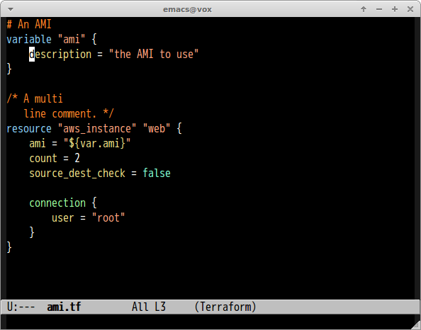
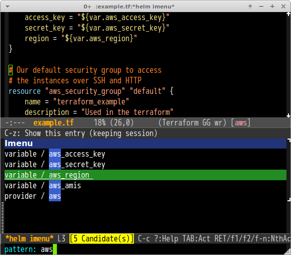

# terraform-mode.el [![travis badge][travis-badge]][travis-link] [![melpa badge][melpa-badge]][melpa-link] [![melpa stable badge][melpa-stable-badge]][melpa-stable-link]

Major mode of [Terraform](http://www.terraform.io/) configuration file


## Screenshot



#### imenu(`helm-imenu`)




## Installation

You can install `terraform-mode.el` from [MELPA](https://melpa.org/) by `package.el`.


## Features

- Syntax highlighting
- Indentation
- imenu


## Customize Variables

#### `terraform-indent-level`(Default: `2`)

Indentation size. You need to call `revert-buffer` if you change this value outer of hook such as `eval-expression`.

## Sample Configuration

```lisp
(custom-set-variables
 '(terraform-indent-level 4))
 
;; to automatically enter terraform-mode upon entering .tf files 
;; add this to your init file (.emacs, etc.)
(add-to-list 'auto-mode-alist '("\\.tf$" . terraform-mode))
```

## See Also

- [hcl-mode](https://github.com/syohex/emacs-hcl-mode)

[travis-badge]: https://travis-ci.org/syohex/emacs-terraform-mode.svg
[travis-link]: https://travis-ci.org/syohex/emacs-terraform-mode
[melpa-link]: https://melpa.org/#/terraform-mode
[melpa-stable-link]: https://stable.melpa.org/#/terraform-mode
[melpa-badge]: https://melpa.org/packages/terraform-mode-badge.svg
[melpa-stable-badge]: https://stable.melpa.org/packages/terraform-mode-badge.svg
